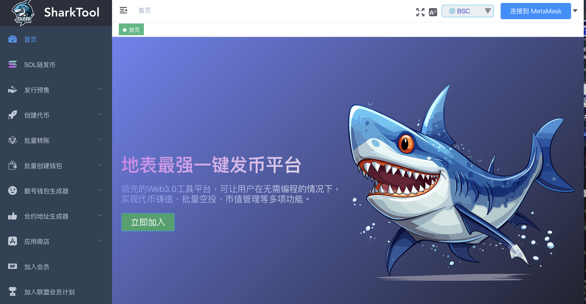

# SharkTool一键发币助手
SharkTool全网最强一键发币工具，支持BSC、Solana、ETH、Base、Arb、TON等不同区块链发币，旨在满足快速增长的加密货币去中心化金融（DeFi）领域用户的需求。SharkTool提供可视化的界面，让用户能够快速创建、部署和管理自己的加密货币，而无需编写代码。此外，SharkTool还提供一些附加功能，如跨链闪兑、批量转账空投、批量生成账号、市值管理等，未来还将推出代币预售、代币锁定与解锁、合约审计等多项服务。

**官网**：https://sharktool.org/

**Solana发币**：https://solana.sharktool.org/

**交流群**: https://t.me/sharktoolcn

## 代币模板/机制
[标准代币](https://sharktool.org/#/StandarToken)：干净合约、方便上手、无税无功能、Ave检测全绿

[分红本币](https://sharktool.org/#/DividendToken)：简单干净合约,无黑白名单,无权限,加池自动开盘,持币即可获益

[LP分红代币](https://sharktool.org/#/LpDividend)：加池参与分红、池子越来越厚，币价螺旋上涨

[LP挖矿+推荐奖励](https://sharktool.org/#/LprewardToken)：加池挖矿、恒定产出、无前端无后端、完全去中心化运行

[手机TP钱包发币](https://sharktool.gitbook.io/sharktool/createtoken/shou-ji-tp-qian-bao-fa-bi-jiao-cheng)：支持用手机版本的TP钱包发币，方便快捷易操作

## 创建预售
[创建预售工具](https://sharktool.org/#/Presale/cratepresale)：该预售无需前端，转账即预售、链上可查、100%去中心化

[预售控制台](https://sharktool.org/#/PresaleBackend)：修改预售价格、预售份额、实时查看预售数据

[创建预售教程](https://sharktool.gitbook.io/sharktool/createpresale/presaletutorial)：最完全的预售创建教程，看了就能学会

## Solana一键发币
[Solana发币官网](https://solana.sharktool.org/)：全网最强的Solana一键发币平台，快速稳定有保障

[Solana更新代币资料](https://solana.sharktool.org/updatemetadata)：更新代币名称、logo、社交媒体链接等

[创建OpenBook ID](https://solana.sharktool.org/market/create)：快速创建OpenBook Market ID，最低0.55sol

[Solana权限管理](https://solana.sharktool.org/tokencontrol)：可丢弃Solana代币权限，也可以拉黑、增发等

[Solana烧池子](https://solana.sharktool.org/burntoken)：Solana烧池子工具，可以销毁LP以及销毁代

[Solana创建钱包](https://sharktool.org/#/createWallet/Solanawallet)：批量生成Solana钱包，1分钟生成几千个

[Solana发币教程](https://sharktool.gitbook.io/sharktool/solana/createtoken)：Solana发币、做池子、销毁LP、市值管理教程

## 批量转账（空投）
[EVM链空投工具](https://sharktool.org/#/Batchtransfer/BSC-Mainnet)：支持BSC区块链的代币空投

[EVM链空投教程](https://sharktool.gitbook.io/sharktool/operating-tools/multi-transfer)：1分钟教会你在币安链、Base链上空投代币

## 批量生成钱包
[ETH兼容链工具](https://sharktool.org/#/createWallet/EVMwallet)：生成的钱包支持ETH、BSC、BASE、ARB等

[波场链工具](https://sharktool.org/#/createWallet/Tronwallet)：批量生成波场链TRX钱包

[Solana创建钱包](https://sharktool.org/#/createWallet/Solanawallet)：批量生成Solana钱包，1分钟生成几千个

## 自定义钱包地址
[ETH兼容链工具](https://sharktool.org/#/VanityWallet/CreateVanityWallet)：生成的钱包支持ETH、BSC、BASE、ARB等

[波场链工具](https://sharktool.org/#/VanityWallet/Tronvanitywallet)：自定义钱包的前后缀地址

[Solana创建钱包](https://sharktool.org/#/VanityWallet/Solanawallet)：自定义钱包的前后缀地址

## 自定义合约地址
[ETH兼容链](https://sharktool.org/#/VanityContract/EVMVanityContract)：自定义部署的代币合约地址

## 其他工具
[BSC-USDT监控机器人](https://sharktool.org/#/usdtmonitor)：实时监控BSC网络上的USDT交易。
[EVM钱包监控机器人](https://sharktool.org/#/EMVWalletMonitor)：实时监控指定钱包的usdt转账情况。
[波场TRX + USDT监控机器人](https://sharktool.org/#/TronUsdtMonitor)：监控波场全网trx和usdt转账情况。
[波场钱包监控](https://sharktool.org/#/TronWalletMonitor)：实时监控指定钱包地址trx转账。

## Telegram营销工具
[电报营销神器](https://sharktool.org/#/TelgeramMarketing/Chaoqun)：炒群，采集群用户，批量拉人。

## 服务费用
[SharkTool收费标准](https://sharktool.gitbook.io/sharktool/servicefee)：全网最具竞争力的低费用发币平台

## 社交媒体
**Twitter**：https://twitter.com/SharkToolX
**Youtobe**：https://www.youtube.com/@SharkToolOfficial
**Telegram**：https://t.me/sharktoolcn
